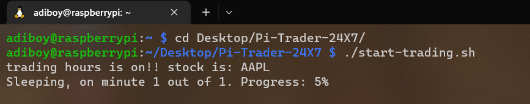
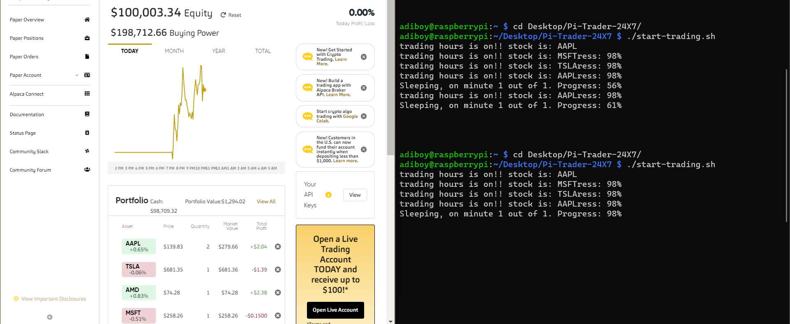
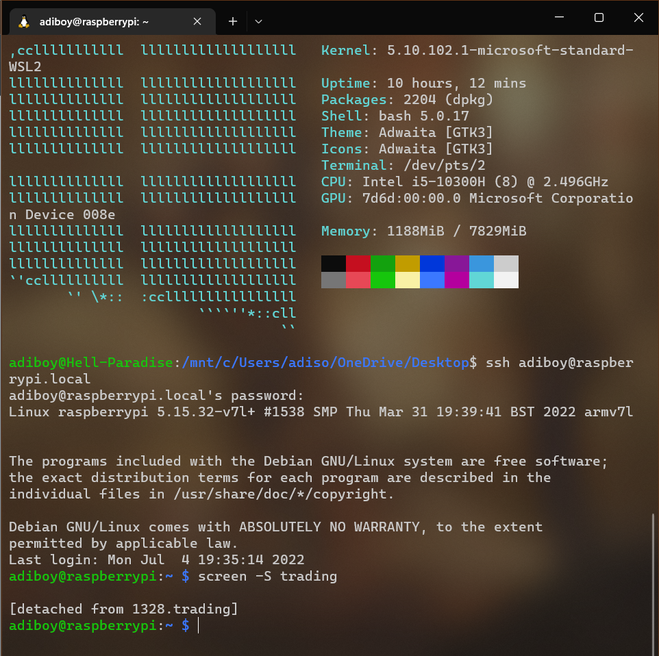
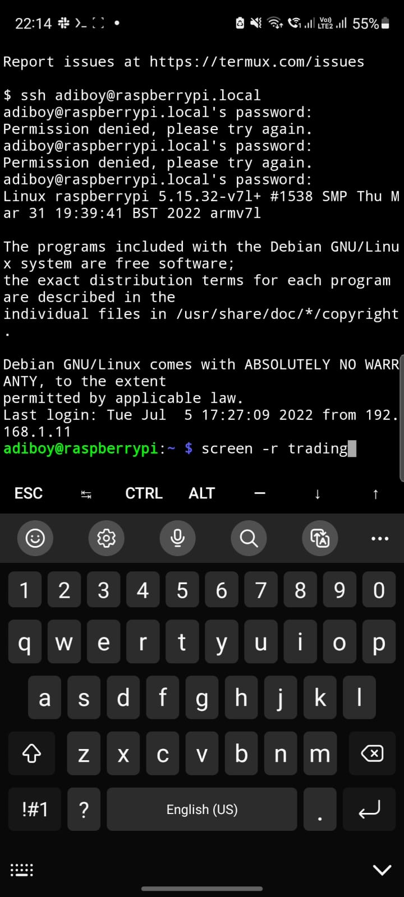
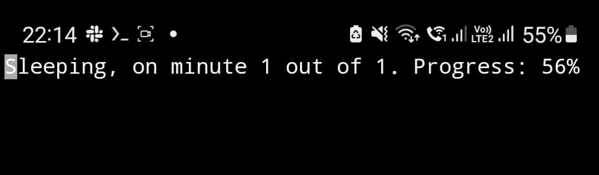

# Pi-Trader-24X7

I am trying to make a trading bot on Raspberry Pi 4 using Alpaca trading API from scratch and later implement some profitable trading strategies to make little money. My objective is to trade in different time zone markets without actually logging to the trading workstation. In this case I am trading in US stock exchange market.

## Installation

To start, make a account on [Alpaca trading](https://app.alpaca.markets/brokerage/new-account/overview), you dont need to make Live trading account for testing purposes you can try paper trading.
In this programme I am currently using Paper Trading API. 

Clone this repository:

    git clone https://github.com/Adiboy3112/Pi-Trader-24X7.git

Change directory

    cd Pi-Trader-24X7

Generate your [API keys](https://app.alpaca.markets/paper/dashboard/overview) 

In the cloned Repository make newfile `keys.txt` add your API keys in this format:

    API_KEY_ID=<your API KEY ID>
    API_SECRET_KEY=<your API SECRET KEY>
    BASE_URL=https://paper-api.alpaca.markets

**NOTE: Change BASE_URL for Live Trading**

**NOTE: Don't leave a space after "`=`" sign**

You can change your stocks of interest here in `main.py`:

    stocks_list = ["AAPL", "MSFT","TSLA"]

Now to start add your trading strategy for the day in `main.py`:

    def trading_strategy(api, stock):

Now to get started start a screen session:

    screen -S <name-your-session>

Now run the startup script:

    ./start-trading.sh

To detach from this screen press `CTRL+A` then `CTRL+D`

Now to again reattach to this session to check status:

    screen -r <name-your-session>

There are many helper functions in tools.py use them according to your need.

## Deployment Demo

I deployed the programme on Raspberry Pi 4 and kept the programme running finally when it was trading hrs. My orders were placed from my stock list without logging into the workstation 

  

  

### Detached from the session: 

    

### Reatached from my Mobile Terminux App:

  

  

